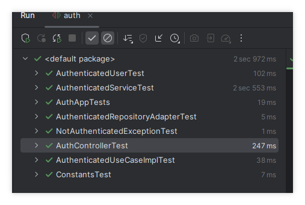
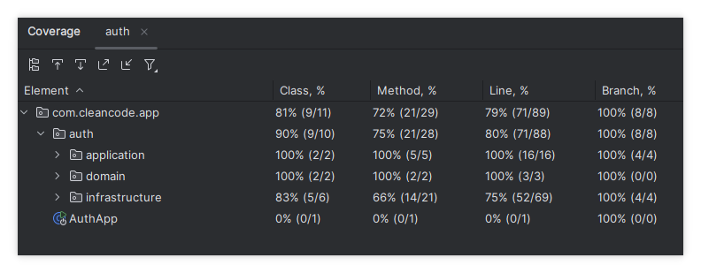
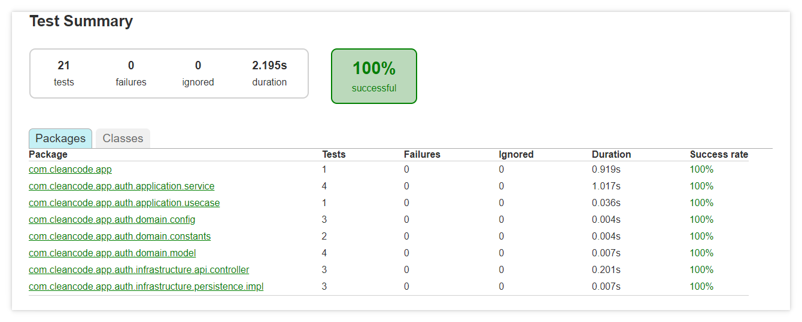

 ## 🛡️ Clean Authentication
* Proyecto Spring Boot con autenticación OAuth2 utilizando Google y GitHub, siguiendo la arquitectura hexagonal, con soporte para Java 21, pruebas unitarias con JUnit 5, cobertura de código con JaCoCo, y reducción de boilerplate gracias a Lombok.

# 1. ✅ Tecnologías principales
* Java 21 Lenguaje base moderno, seguro y con nuevas características de rendimiento.
* Spring Boot 3	Framework para el desarrollo rápido de microservicios.
* Spring Security	Protección de endpoints y manejo de sesiones autenticadas.
* OAuth2 Client	Login social con Google y GitHub.
* Arquitectura Hexagonal	Separación de lógica de negocio y adaptadores externos.
* Lombok	Reducción de código repetitivo como getters/setters.
* JUnit 5	Framework de pruebas moderno para Java.
* JaCoCo	Herramienta de cobertura de código.

# 2. 🔐 Autenticación OAuth2
* La app permite iniciar sesión con:

✅ Google
✅ GitHub
* Redirecciones configuradas:

* 🔄 Login exitoso: http://localhost:4200/auth/success
* ❌ Error de login: http://localhost:4200/auth/error
* 🔓 Logout: http://localhost:4200/auth/logout

# 3. 🧱 Arquitectura Hexagonal
Separación clara entre:

* Core / Dominio: lógica central (AuthenticatedUser, interfaces como AuthenticatedRepositoryPort).
* Adapters (Entrantes / Salientes):
* Entrantes: AuthController (maneja peticiones HTTP).
* Salientes: AuthenticatedRepositoryAdapter (obtiene datos desde OAuth2).
* Infraestructura: configuración Spring, seguridad, y proveedores OAuth2.

### 4. developers config client_id, client_secret

* https://console.cloud.google.com/
* https://github.com/settings/developers
# 5. 🧪 Pruebas con JUnit 5
* Todas las pruebas están en src/test/java.
* Uso de anotaciones modernas de JUnit 5 (@Test, @BeforeEach, etc.).
  

## 6. 📈 Cobertura con JaCoCo
./gradlew jacocoTestReport

# 7. 🚀 Ejecución
./gradlew bootRun
